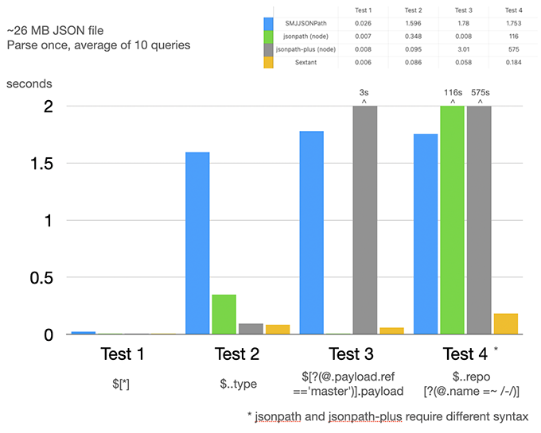

## Sextant

Sextant is a complete, high performance JSONPath implementation written in Swift. It was originally ported from [SMJJSONPath](https://github.com/javerous/SMJJSONPath), which in turn is a tight adaptation of the [Jayway JsonPath](https://github.com/json-path/JsonPath) implementation. Sextant has since been updated to bring it into compliance with other JSON path implementations ([see issue](https://github.com/javerous/SMJJSONPath/issues/6)), so this specific implementation now varies from the SMJJSONPath/Jayway implementation.

## Overview

The original [Stefan Goessner JsonPath implemenentation](https://goessner.net/articles/JsonPath/) was released in 2007, and from it spawned dozens of different implementations. This [JSONPath Comparison](https://cburgmer.github.io/json-path-comparison/) chart shows the wide array of available implemenations, and at the time of this writing a Swift implementation is not present (note that there exists the [SwiftPath](https://github.com/g-mark/SwiftPath) project, but it is not included in said chart [due to critical errors when running on Linux](https://github.com/g-mark/SwiftPath/issues/15).

Need to learn more about JSONPath before using Sextant? I recommend reading the [Jayway JsonPath Getting Started](https://github.com/json-path/JsonPath#getting-started) section.

## Goals

- [x] Simple API
- [x] Full JSONPath implementation
- [x] Modification of paths ( use map/filter/remove/forEach )
- [x] High performance
- [x] Linux support

## Usage


```swift
/// Each call to Sextant's query(values: ) will return an array on success and nil on failure
func testSimple0() {
    let json = #"["Hello","World"]"#
    guard let results = json.query(values: "$[0]") else { return XCTFail() }
    XCTAssertEqualAny(results[0], "Hello")
}
```

```swift
/// Works with any existing JSON-like structure
func testSimple2() {
    let data = [ "Hello", "World" ]
    guard let results = data.query(values: "$[0]") else { return XCTFail() }
    XCTAssertEqualAny(results[0], "Hello")
}
```

```swift
/// Automatically covert to simple tuples
func testSimple3() {
    let json = #"{"name":"Rocco","age":42}"#
    
    guard let person: (name: String?, age: Int?) = json.query("$.['name','age']") else { return XCTFail() }
    XCTAssertEqual(person.name, "Rocco")
    XCTAssertEqual(person.age, 42)
}
```

```swift
/// Supports Decodable structs
func testSimple4() {
    let json = #"{"data":{"people":[{"name":"Rocco","age":42},{"name":"John","age":12},{"name":"Elizabeth","age":35},{"name":"Victoria","age":85}]}}"#
    
    class Person: Decodable {
        let name: String
        let age: Int
    }
    
    guard let persons: [Person] = json.query("$..[?(@.name)]") else { return XCTFail() }
    XCTAssertEqual(persons[0].name, "Rocco")
    XCTAssertEqual(persons[0].age, 42)
    XCTAssertEqual(persons[2].name, "Elizabeth")
    XCTAssertEqual(persons[2].age, 35)
}
```

```swift
/// Easily combine results from multiple queries
func testSimple5() {
    let json1 = #"{"error":"Error format 1"}"#
    let json2 = #"{"errors":[{"title:":"Error!","detail":"Error format 2"}]}"#
            
    let queries: [String] = [
        "$.error",
        "$.errors[0].detail",
    ]
    
    XCTAssertEqualAny(json1.query(string: queries), "Error format 1")
    XCTAssertEqualAny(json2.query(string: queries), "Error format 2")
}
```

```swift
/// High performance JSON processing by using .parsed() to get
/// a quick view of the raw json to execute on paths on
func testSimple9() {
    let data = #"{"DtCutOff":"2018-01-01 00:00:00","ServiceGroups":[{"ServiceName":"Service1","DtUpdate":"2021-11-22 00:00:00","OrderNumber":"123456","Active":"true"},{"ServiceName":"Service2","DtUpdate":"2021-11-20 00:00:00","OrderNumber":"123456","Active":true},{"ServiceName":"Service3","DtUpdate":"2021-11-10 00:00:00","OrderNumber":"123456","Active":false}]}"#
        
    data.parsed { json in
        guard let json = json else { XCTFail(); return }
    
        guard let isActive: Bool = json.query("$.ServiceGroups[*][?(@.ServiceName=='Service1')].Active") else { XCTFail(); return }
        XCTAssertEqual(isActive, true)
        
        guard let date: Date = json.query("$.ServiceGroups[*][?(@.ServiceName=='Service1')].DtUpdate") else { XCTFail(); return }
        XCTAssertEqual(date, "2021-11-22 00:00:00".date())
    }
}
```

```swift
/// Use replace, map, filter, remove and forEach to perform mofications to your json
func testSimple10() {
    let json = #"{"data":{"people":[{"name":"Rocco","age":42,"gender":"m"},{"name":"John","age":12,"gender":"m"},{"name":"Elizabeth","age":35,"gender":"f"},{"name":"Victoria","age":85,"gender":"f"}]}}"#

    let modifiedJson: String? = json.parsed { root in
        guard let root = root else { XCTFail(); return nil }
        
        // Remove all females
        root.query(remove: "$..people[?(@.gender=='f')]")
        
        // Incremet all ages by 1
        root.query(map: "$..age", {
            guard let age = $0.intValue else { return $0 }
            return age + 1
        })
        
        // Lowercase all names
        root.query(map: "$..name", { $0.hitchValue?.lowercase() })
        
        return root.description
    }
    
    XCTAssertEqual(modifiedJson, #"{"data":{"people":[{"name":"rocco","age":43,"gender":"m"},{"name":"john","age":13,"gender":"m"}]}}"#)
}
```

```swift
/// Use a single map to accomplish the same task as above but with only one pass through the data
func testSimple11() {
    let json = #"{"data":{"people":[{"name":"Rocco","age":42,"gender":"m"},{"name":"John","age":12,"gender":"m"},{"name":"Elizabeth","age":35,"gender":"f"},{"name":"Victoria","age":85,"gender":"f"}]}}"#
    
    let modifiedJson: String? = json.query(map: "$..people[*] ", { person in
        // Remove all females, increment age by 1, lowercase all names
        guard person["gender"]?.stringValue == "m" else {
            return nil
        }
        if let age = person["age"]?.intValue {
            person.set(key: "age", value: age + 1)
        }
        if let name = person["name"]?.hitchValue {
            person.set(key: "name", value: name.lowercase())
        }
        return person
    }) { root in
        return root.description
    }

    XCTAssertEqual(modifiedJson, #"{"data":{"people":[{"name":"rocco","age":43,"gender":"m"},{"name":"john","age":13,"gender":"m"}]}}"#)
}
```

## Performance

Sextant utilizes [Hitch](https://github.com/KittyMac/Hitch) (high performance strings) and [Spanker](https://github.com/KittyMac/Spanker) (high performance, low overhead JSON deserialization) to provide a best-in-class JSONPath implementation for Swift. Hitch allows for fast, utf8 shared memory strings. Spanker generates a low cost view of the JSON blob which Sextant then queries the JSONPath against. Nothing is deserialized and no memory is copied from the source JSON blob until they are returned as results from the query. Sextant really shines in scenarios where you have a large amount of JSON and/or a large number of queries to run against it.



## Installation

Sextant is fully compatible with the Swift Package Manager

```
dependencies: [
    .package(url: "https://github.com/KittyMac/Sextant.git", .upToNextMinor(from: "0.4.0"))
],
```

## License

Sextant is free software distributed under the terms of the MIT license, reproduced below. Sextant may be used for any purpose, including commercial purposes, at absolutely no cost. No paperwork, no royalties, no GNU-like "copyleft" restrictions. Just download and enjoy.

Copyright (c) 2021 [Chimera Software, LLC](http://www.chimerasw.com)

Permission is hereby granted, free of charge, to any person obtaining a copy of this software and associated documentation files (the "Software"), to deal in the Software without restriction, including without limitation the rights to use, copy, modify, merge, publish, distribute, sublicense, and/or sell copies of the Software, and to permit persons to whom the Software is furnished to do so, subject to the following conditions:

The above copyright notice and this permission notice shall be included in all copies or substantial portions of the Software.

THE SOFTWARE IS PROVIDED "AS IS", WITHOUT WARRANTY OF ANY KIND, EXPRESS OR IMPLIED, INCLUDING BUT NOT LIMITED TO THE WARRANTIES OF MERCHANTABILITY, FITNESS FOR A PARTICULAR PURPOSE AND NONINFRINGEMENT. IN NO EVENT SHALL THE AUTHORS OR COPYRIGHT HOLDERS BE LIABLE FOR ANY CLAIM, DAMAGES OR OTHER LIABILITY, WHETHER IN AN ACTION OF CONTRACT, TORT OR OTHERWISE, ARISING FROM, OUT OF OR IN CONNECTION WITH THE SOFTWARE OR THE USE OR OTHER DEALINGS IN THE SOFTWARE.
